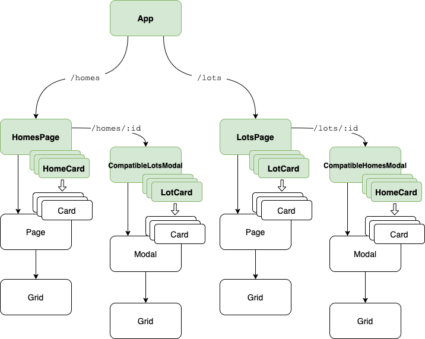

# My take home project for Atmos

View project at live link: https://atmos-take-home.web.app/

## Component flow chart

Here is a basic overview of the component structure. Components in green read/write to the redux store. Each green component has a hook that encapsulates data processing and callback functions that are passed to the presentational components.

Components in white only handle the presentation of data.



I have a `Card`/`Modal` for `Home` and `Lot` because those objects are presented the same in UI and their fields don't line up exactly. You can think of `HomeCard` and `LotCard` as mappers.

## Redux store

```
{
    inventory: {
        homes: []                 # list of homes
        lots: []                  # list of lots
    }
    combinations: []              # list of home/lot id combos
    favorites: {
        homes: []                 # list of home ids that have been favorited
        lots: []                  # list of lot ids that have been favorited
        showFavoriteHomes: false  # boolean if favorite home view should be shown
        showFavoriteLots: false   # boolean if favorite lot view should be shown
    }
}
```

## Other considerations

I thought about updating each `Home` in my store to have a list field of ids that mapped directly to compatible lots 
(and a field on each `Lot` that mapped to compatible homes). Preprocessing `combinations` would make my component logic simpler.

I was thinking I could fetch my fake API somewhere else instead of the root.

I could handle errors for trying to access missing homes and lots that didn't exist

Having 2 Page and 2 Modal components might seem redundant. There's likely a way to combine them.

---

### `yarn start`

Runs the app in the development mode.\
Open [http://localhost:3000](http://localhost:3000) to view it in the browser.

The page will reload if you make edits.\
You will also see any lint errors in the console.

### `yarn test`

Launches the test runner in the interactive watch mode.\
See the section about [running tests](https://facebook.github.io/create-react-app/docs/running-tests) for more information.

### `yarn build`

Builds the app for production to the `build` folder.\
It correctly bundles React in production mode and optimizes the build for the best performance.

The build is minified and the filenames include the hashes.\
Your app is ready to be deployed!

See the section about [deployment](https://facebook.github.io/create-react-app/docs/deployment) for more information.

### `yarn eject`

**Note: this is a one-way operation. Once you `eject`, you can’t go back!**

If you aren’t satisfied with the build tool and configuration choices, you can `eject` at any time. This command will remove the single build dependency from your project.

Instead, it will copy all the configuration files and the transitive dependencies (webpack, Babel, ESLint, etc) right into your project so you have full control over them. All of the commands except `eject` will still work, but they will point to the copied scripts so you can tweak them. At this point you’re on your own.

You don’t have to ever use `eject`. The curated feature set is suitable for small and middle deployments, and you shouldn’t feel obligated to use this feature. However we understand that this tool wouldn’t be useful if you couldn’t customize it when you are ready for it.

## Learn More

You can learn more in the [Create React App documentation](https://facebook.github.io/create-react-app/docs/getting-started).

To learn React, check out the [React documentation](https://reactjs.org/).
